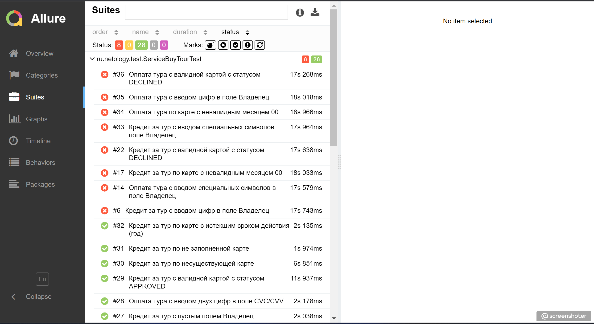

# Отчёт по итогам тестирования

## 1. Краткое описание:

В данном проекте было проведено тестирование функциональности веб-приложения . Основной целью тестирования была проверка корректной работы основных функций приложения и выявление возможных дефектов.

## 2. Количество тест-кейсов:

Всего было выполнено 36 тест-кейсов, охватывающих различные сценарии использования приложения.

## 3. Процент успешных и неуспешных тест-кейсов:

Из общего числа выполненных тестов 28 завершились успешно, что составляет приблизительно 77% от общего количества тест-кейсов. 8 тестов завершились с ошибками, что составляет приблизительно 23% от общего количества тест-кейсов.

## 4. Общие рекомендации:

По результатам тестирования были выявлены следующие рекомендации:

* Создать документацию с подробным описанием функциональности приложения и инструкциями по тестированию. Это поможет облегчить работу тестировщиков и повысить понимание особенностей приложения.

* Изменить имена ошибок для полей в многих полях, так как текущие имена не всегда отражают суть проблемы. Например, заменить "Неверный формат" на "Некорректный ввод данных" или "Неправильное значение".

* Необходимо улучшить обработку ошибок и предоставление пользователю информативных сообщений о возникающих проблемах. Это поможет снизить количество неуспешных тест-кейсов и повысить удовлетворенность пользователей приложением.